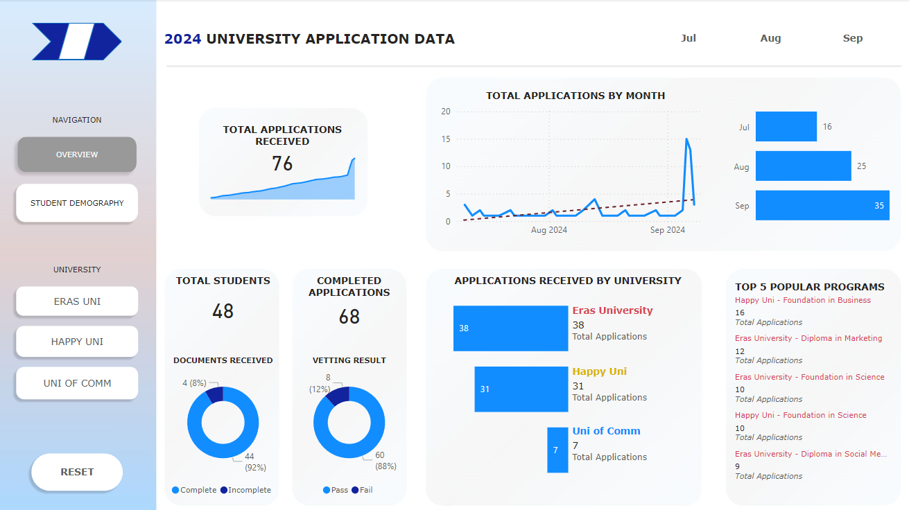

# Data Analysis: University Student Applications

## Project Overview

This project is a data analysis of student applications to three universities using **Power BI**. The goal of the project is to gain insights into student application trends, demographics, and other relevant details.



### Key Features:
- **Interactive Dashboards**: A user-friendly Power BI dashboard displaying student application data in an interactive format.
- **Data Insights**: Analysis of trends such as:
  - Application rates over time.
  - Demography of applicants.
  - Percentage of completed applications.
  - Comparison of the most applied-to programs.
- **Data Visualization**: Visual charts and graphs to represent the trends for easier interpretation.

## Data Sources

The dataset used in this project is simulated data representing student applications. The data includes the following fields:
- **University Name**: The name of the institution (Eras University, Happy University, Uni of Comm).
- **Student Demographics**: Gender, Citizenship and Income Group.
- **Application Data**: Application date, program applied for and vetting status.

## Tools and Technologies Used

- **Power BI**: Main tool used for data analysis and visualization.
- **Data Cleaning**: Basic data preprocessing done using GSheets.
- **GitHub**: For documentation.

## How to Use

1. **Clone this repository**:
    ```bash
    git clone https://github.com/adlinso/analysis-uniapplication-powerbi.git
    ```

2. Open the `.pbix` file in **Power BI Desktop** to explore the dashboards and visualizations.

3. Customize the dashboard by importing your own dataset or modifying the existing one.
